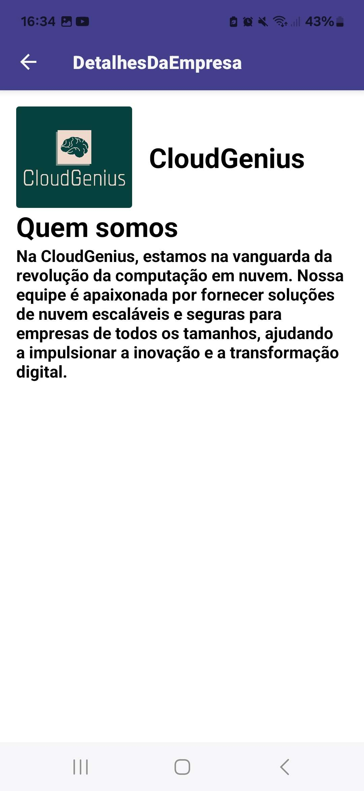

<h1 align="center">SpeedVagas</h1>

---

## 💡 Sobre o Projeto ##

Este aplicativo é uma aplicação web que permite gerenciar musicas e playlists e reproduzi-las:
- **Feed**: Página inicial, navegue pelas vagas e escolha a que combina com você.
<p align="center">
  
</p>
<br><br>

- **Vaga**: Exibe as informações sobre a vaga escolhida.
<p align="center">
  
</p>
<br><br>

- **Empresa**: Exibe as informações sobre a empresa.
<p align="center">
  
</p>
<br><br>


## 🚀 Como Executar o Projeto
Siga os passos abaixo para executar o projeto em seu ambiente local:
   
1. **Clone o repositório**
   ```bash
   git clone https://github.com/Guedes663/React-Native
   ```
   
2. **Navegue até os arquivos**
   ```bash
   cd React-Native
   ```

3. **Instalação de Dependências**
   ```bash
   npm install
   ```

4. **Inicialização da Aplicação**
   ```bash
   npx expo start
   ```

## 👨‍💻 Autores
- [Gabriel Guedes](https://github.com/Guedes663)
- [Victor Dala](https://github.com/Victordplima)
- [Sávio Carlos](https://github.com/SavioCarlos)
- [Vanessa Bicario](https://github.com/VanessaBicarioMassi)
- [Júlio Cesar](https://github.com/juliocesarmlk)
- [Davi Bertoni](https://github.com/DaviBertoni)
- [Otávio Barros](https://github.com/otaviotiltado45)
